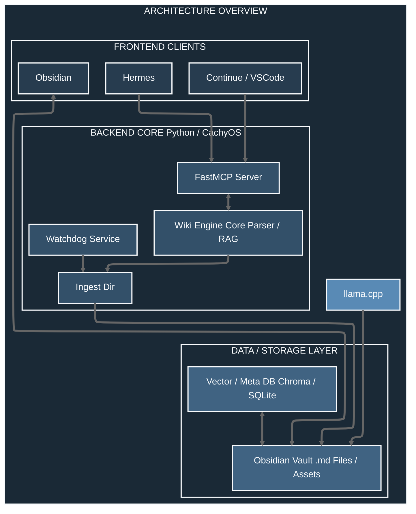

# AI Operating System Backend
## Software Requirements

> **Prompt Quote from 2026-06-24 11:00AM**
> I need your help writing a requirements document. I want to create a backend tool to directly, initiate, and instruct a local AI in creating, managing, updating, searching, etc... an LLM Wiki based on Karpathy's LLM Wiki concept. The frontend will be Obsidian.md (for the user), Hermes Desktop (for interacting with AI in searching, and discussions), VSCode with Continue.dev (for user to code multiple types of projects), and other tools for user use. The backend will be created using Python on Cachyos, the LLM provider will be llama.cpp, Watchdog service will be created to monitor an ingest directory that the user will put specific information in, FastMCP will be used as the Model Context Protocol to provide tools for Hermes Desktop and VSCode. The requirements document will need to provide all functionality, schema's, LLM promtps, diagrams, etc... to help me write the backend. I will be using AI to assist me with writing the backend in an efficient, secure, and modular manor.


**Below is the Gemini response to my request. I would like you to pick up where Gemini left off and help me write a well planned out requirements document.**

# System Architectuer Overview



## 1. Function Requirements

### 1.1 Automated Ingestion (Watchdog)

- **Directory Monitoring**: Continuously poll a dedicated `~/wiki_ingest/` directory for incoming raw data (`.txt`, `.md`, `.pdf`, `.json`, `.yaml`, `.yml`, raw URLs in a text file).
- **Proccessing Pipeline**: 1. Detect new file -> 2. Extract raw text -> 3. Send to `llama.cpp` for structural synthesis (summarization, cross-linking metadata generation) -> 4. Commit generated `.md` file to the Obsidian vault -> 5. Move raw file to an `archive/` folder.
- **Idempotency**: Prevent dupicate ingestion of identical files via SHA-256 hashing.

### 1.2 The LLM Wiki Engine (Karpathy Style)

- **Automic Notes**: Ensure notes are concept-focused, highly dense, and inter-linked.
- **Bi-directional Linking**: The backend must parse and append `[[Wiki Links]]` programmatically when updating notes based on context.
- **Frontmatter Management**: Maintain unified YAML blocks for metadata (tags, created/modified dates, structural connections).

### 1.3 Model Context Protocol (FastMCP Server)

- **Context Bridging**: Act as the single source of truth for both Hermes Desktop and VSCode/Continue.dev.
- **Dynamic Tooling**: Expose Python functions as schema-validated tools for the LLMs to read, write, and patch the knowledge base.

## 2. System Architecture & Component Specification

### 2.1 Technology Stack

- **OS**: CachyOS (Arch-based, optimized for low-latency kernel execution—ideal for pinning execution tasks).
- **Runtime**: Python 3.11+ (leveraging `asyncio` for non-blocking Watchdog and FastMCP operations).
- **LLM Inference**: `llama.cpp` running locally as a background server (`llama-server`) exposing an OpenAI-compatible API endpoints.
- Orchestration Framework: `FastMCP` (Python SDK).

### 2.2 Security & Isolation Guardrails

- **Localhost Hardening**: Bind `llama.cpp` and FastMCP exclusively to `127.0.0.1`.
- **Path Sanitization**: Enforce strict directory path sandboxing. Any attempt by the LLM or client to write outside the explicit Obsidian Vault or Ingest directories must throw an immediate `PermissionError`.

## 3. Data Schemas & File Formats

To keep the system lightweight and grep-friendly, metadata is split between **Markdown Frontmatter** (for human readability/Obsidian) and a **local SQLite database** (for fast relational lookups and indexing status).

### 3.1 Structural Markdown Schema (Obsidian)

Every note created or modified by the backend must follow this strict structure:

```markdown
---
id: "UUID-v4"
title: "Concept Name"
tags: [concept, sub-topic, project-xyz]
created: YYYY-MM-DD HH:MM:SS
modified: YYYY-MM-DD HH:MM:SS
checksum: "SHA-256-Hash"
---

# Concept Name

## Summary
A single-sentence dense explanation of the concept.

## Context & Core Mechanics
Detailed breakdown. 

## Relationships & Cross-References
* [[Related Concept A]] - Description of how it links.
* [[Related Concept B]] - Alternative approach.

## Code / Implementation References (If Applicable)
```

### 3.2 Metadata & Vector Index Schema (SQLite & Vector)

```SQL
CREATE TABLE wiki_meta (
    note_id TEXT PRIMARY KEY,
    file_path TEXT UNIQUE,
    title TEXT,
    sha256 TEXT,
    last_indexed TIMESTAMP DEFAULT CURRENT_TIMESTAMP
);

CREATE TABLE wiki_links (
    source_id TEXT,
    target_id TEXT,
    link_type TEXT,
    PRIMARY KEY (source_id, target_id),
    FOREIGN KEY(source_id) REFERENCES wiki_meta(note_id)
);
```

*(For vector search, use a lightweight, local instance of ChromaDB or Faiss storing the note_id alongside 384-dimensional embeddings like bge-small-en-v1.5).*

## 4. MCP Tools Specification (FastMCP)

These functions are exposed via FastMCP. Both Hermes Desktop and VSCode will natively see these as executable actions.

```Python
from fastmcp import FastMCP
import os

mcp = FastMCP("LocalWikiEngine")

@mcp.tool()
async def search_wiki(query: str, limit: int = 5) -> str:
    """Hybrid semantic and keyword search across the LLM Wiki."""
    # Backend merges vector DB hits and SQLite keyword hits
    return "Consolidated search results with paths and match snippets."

@mcp.tool()
async def read_wiki_note(note_title: str) -> str:
    """Retrieves the complete content and frontmatter of a specific note."""
    return "Raw Markdown Content"

@mcp.tool()
async def write_wiki_note(title: str, content: str, tags: list[str]) -> str:
    """Creates a new structured atomic note in the Obsidian vault, generating frontmatter."""
    return "Success: Note saved to vault."

@mcp.tool()
async def patch_wiki_note(note_title: str, target_section: str, new_content: str) -> str:
    """Updates a specific section of a note without overwriting the entire file."""
    return "Success: Section updated."

@mcp.tool()
async def get_graph_context(note_title: str) -> str:
    """Returns all immediate incoming and outgoing links for a concept (1-degree separation)."""
    return "JSON map of connections"
```

## 5. Core LLM Prompting Blueprints

The backend must use precise, deterministic system prompts when calling llama.cpp to prevent conversational drift or broken Markdown structure.

### 5.1 Ingestion & Synthesis Prompt

```Plaintext
SYSTEM: You are the core parsing engine of a Karpathy-style LLM Knowledge Wiki. Your task is to ingest unstructured data and synthesize it into a clean, atomic, highly dense Markdown note.
INSTRUCTIONS:
1. Extract the core essence of the input text. Strip out fluff, greetings, and boilerplate.
2. Format the response strictly in Markdown with the provided YAML frontmatter skeleton.
3. Identify potential cross-links to existing concepts based on common technical terms and wrap them in [[Double Brackets]].
4. Output ONLY the raw markdown block. Do not provide chat commentary.

INPUT DATA:
{input_text}
```

### 5.2 Context Stitching & Patching Prompt

```Plaintext
SYSTEM: You are a structural knowledge optimization engine. You are given an existing atomic note and new contextual information or code snippets. Your job is to seamlessly integrate the new context into the existing note.
INSTRUCTIONS:
1. Preserve all existing frontmatter keys except for 'modified', which you must update to the current timestamp.
2. Locate the most relevant section to inject or modify the content.
3. If new relationships to other topics are discovered, append them cleanly to the 'Relationships & Cross-References' section.
4. Maintain a laconic, clear, information-dense engineering tone.

EXISTING NOTE:
{existing_note_content}

NEW CONTEXT TO INTEGRATE:
{new_context}
```

## 6. Implementation Roadmap for Your AI Assistant

When you feed this document to your coding AI assistant to generate the backend, instruct it to build step-by-step using this sequence:

- **Phase 1: Environment & File Sandbox Module** – Write the base utilities to handle path safe-checking, config loading, and file operations securely on CachyOS.

- **Phase 2: Ingestion Watchdog** – Implement the watchdog service that monitors ~/wiki_ingest/ asynchronously and handles processing states.

- **Phase 3: llama.cpp Client Engine** – Write the async API client that manages system prompts, context windows, and structural validation of completions.

- **Phase 4: FastMCP Interface** – Wire up the FastMCP tool registry, mapping the Python file utilities and search logic to clean tool endpoints.

- **Phase 5: Integration Testing** – Write mock tests showing a file entering the ingest directory, transforming into an Obsidian note, and being read successfully via an MCP tool request.
